# RoseFinch it is an open source solder controller based on ESP32

[English](.md)

[中文](README_cn.md)

## About

With a little modification, other automation equipment can be controlled.

## Branch

    
**[OpenHeat]** <https://github.com/peng-zhihui/OpenHeat>

Open source smart heating table

**[open source compatible solder]** <https://oshwhub.com/sndnvaps/opent12-jing-jian-ban>

By sndnvaps

## Hardware

**[EasyEDA]** https://oshwhub.com/createskyblue/opent12-jing-jian-ban  
**[Core driver circuit reference]** https://oshwhub.com/47415Y/gong-cheng

**Note: the circuit board is not fully verified**

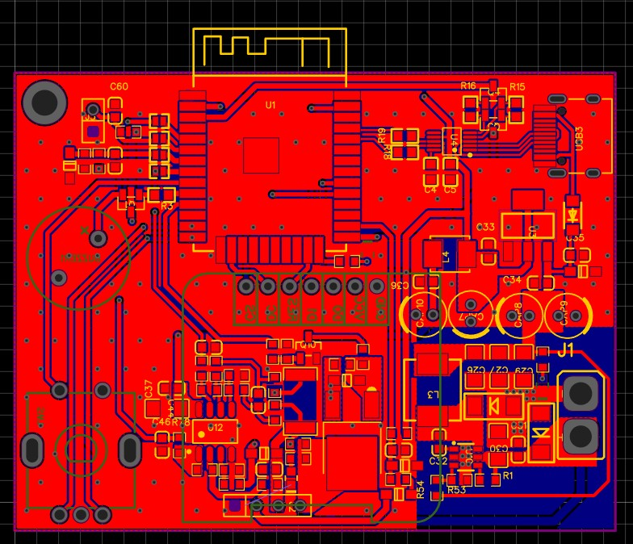

## Vedio

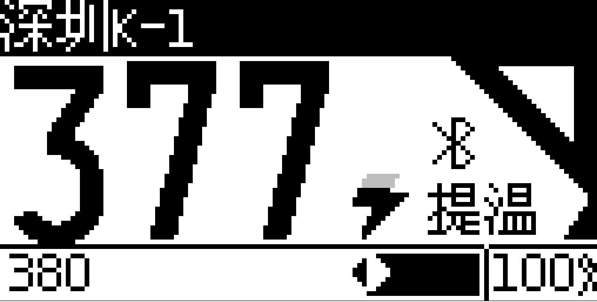
<https://www.bilibili.com/video/BV1s64y1v7mY/>

## Instructions

- The file system will be formatted at the first startup, which will take some time.
- Use **click** in the home screen to enter the burst heating mode.
- In the home screen, use **double click** to call out the PID menu.
- **Press and hold**  in the home screen to open the menu.
- If there are multiple soldering tip configurations, the configuration selection menu will pop up on the home screen when the replacement of soldering tip is detected.
- When adding a new soldering tip configuration, the default parameter is empty. You need to calibrate the temperature and set the parameters yourself.
- **Press and hold** in the main menu to return to the previous level.

## Function

***Compatibility with heating systems***

- [x] ShenzhenT12
- [x] Hot Bed                          (Other branches)
- [ ] High Frequency Welding Table     (Theoretically)
- [ ] Hot Air Gun                      (Theoretically)

***Basic function***

- [x] Support Utf 8 Input.
- [x] Nulti stage PID control heating, multi terminal ADC / PID sampling period setting.
- [x] Start up temperature, burst temperature and sleep temperature can be set.
- [x] It can sleep and shutdown regularly, and customize the burst mode time.
- [x] It can save tens of millions of groups of soldering tips configuration (10 groups by default).
- [ ] Dual sleep modes support: both vibration trigger and magnetic trigger are supported.
- [ ] English support

***Advanced features***

-[x] PMOS and NMOS (default PMOS, because this option is dangerous, the setting needs to be modified on the source program).
-[x] Shortcut key to quickly adjust PID.
-[x] Two sets of PIDs are allowed for each soldering tip.
-[x] Independent ADC / PID sampling period and Kalman filter parameters can be set through the menu.
-[x] 9-stage soldering tip temperature fitting calibration.
-[ ] Temperature self calibration circuit (not implemented).
-[x] Custom display effects: brightness, flip plane, transition animation, display style, list mode.
-[x] Personalized Customization: prompt tone, encoder rotation direction, handle trigger mode, system language (only simplified Chinese is supported temporarily).
-[x] Security settings: Customize startup password, undervoltage alarm, forced shutdown prompt and warning.
-[x] Bluetooth remote command line control.
-[ ] Voice control (not implemented).
-[ ] Custom boot logo (not implemented).

## Pin definition

At present, the final hardware has not been designed. If you want to use your own hardware, you can refer to the following table.

**Screen pin definition**

| I2C | PIN | SPI | PIN |
| :-----: | :----: | :-----: | :----: |
| Screen SCL | 22 | Screen SCK  | 18 |
| Screen SDA | 21 |Screen MOSI | 23 |
|||Screen DC   | 13 |
|||Screen RST  | 15 |
|||Screen CS   | GND (There will be changes in the future)|

**Other pins**

| NANE | PIN |
| :-----: | :----: |
|LED|2 (Future)|
|Beep|25|
|Encoder A|14|
|Encoder B|12|
|Encoder key|33|
|Tip ADC|39|
|Thermal sensitivity ADC|34|
|Voltage ADC|35|
|Current ADC|32|
|PWM1|26|
|PWM2|27 (Future)|
|Vibration switch|4|
|Dry reed pipe|19|

## Compile

First you need to install the Arduino IDE.

### Install esp32 development board

ArduinoIDE-File-Preferences-附加开发板管理网址->Add:

<https://dl.espressif.com/dl/package_esp32_index.json>

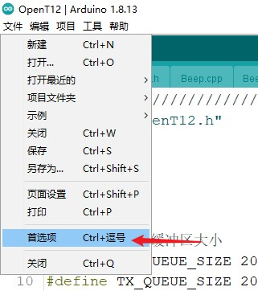
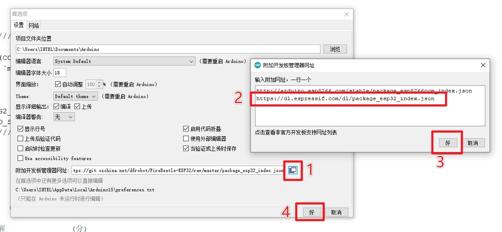

ArduinoIDE-Tools-Development board-Development board manager->Search and install:ESP32

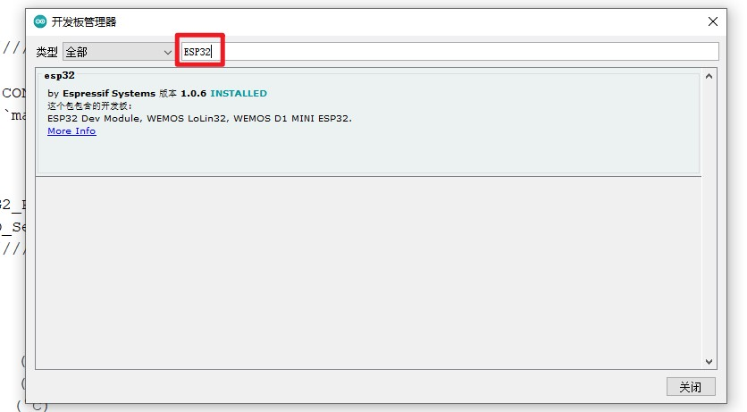

### Dependency Library

| Library | Link |
| :-----: | :-----: |
|U8g2                           |<https://github.com/olikraus/u8g2/>|
|QRCode                         |<https://github.com/ricmoo/qrcode/>|
|OneButton                      |<https://github.com/mathertel/OneButton>|
|Arduino-PID-Library            |<http://playground.arduino.cc/Code/PIDLibrary>|
|GeekFactory_Shell_Library      |<https://github.com/geekfactory/Shell>|

### Select esp32 and configure compilation options

Select development board "ESP32 Dev Module"
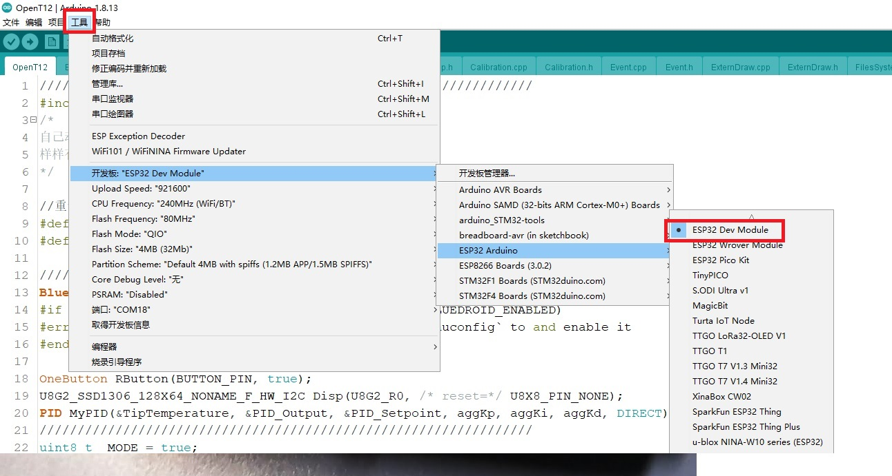

The minimum configuration requires 4 mb of flash space(Minimal SPIFFS 1.9MB APP with OTA/190KB SPIFFS)
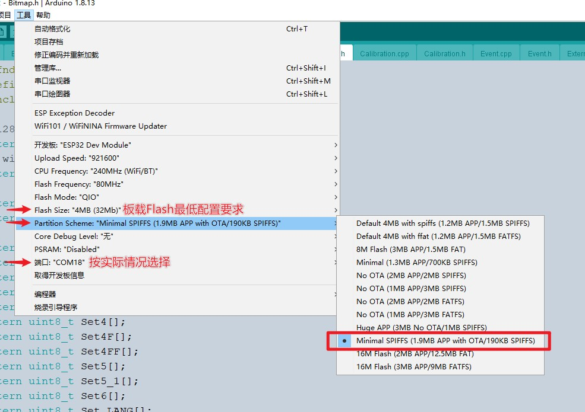

### Compile and upload to the development board

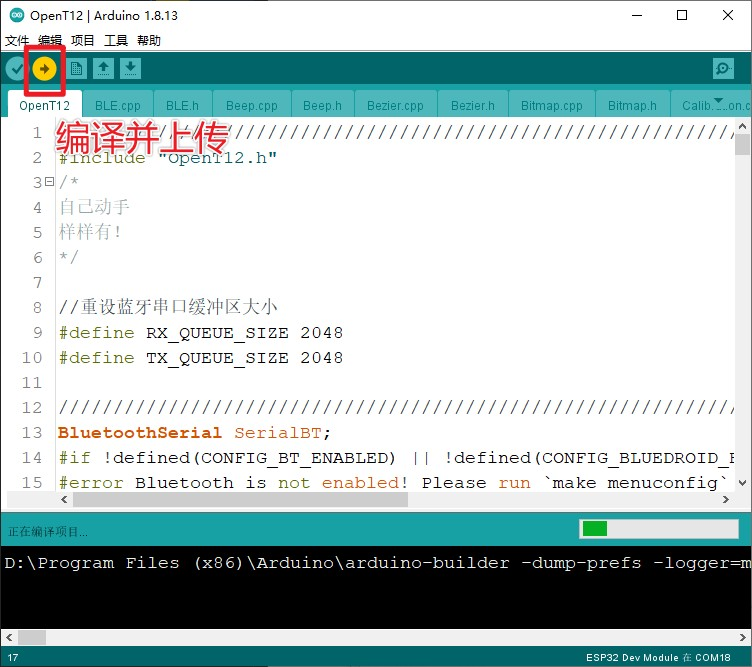
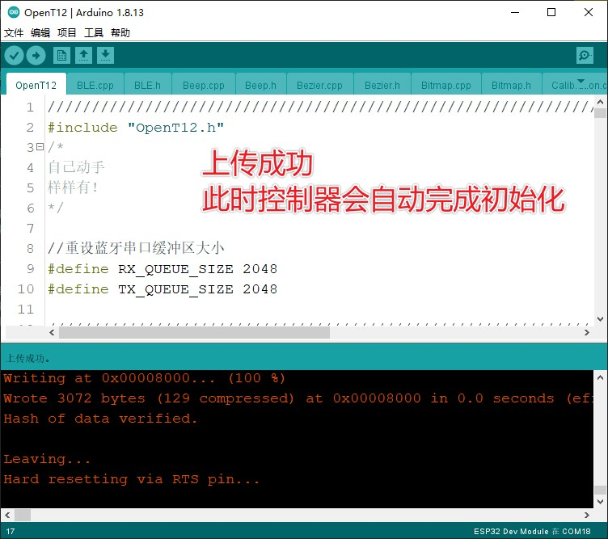

## Demo Screenshot

👇Home Screen

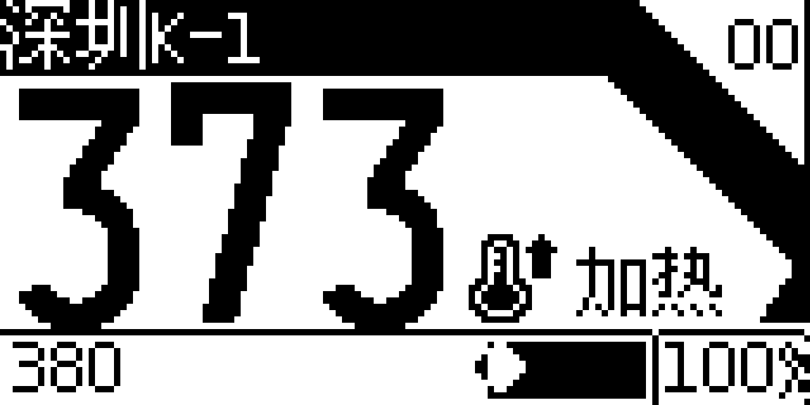
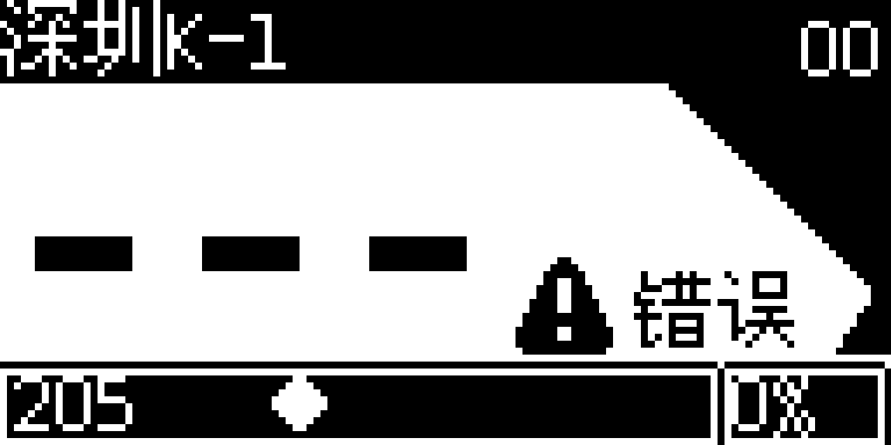

👇Support saving multiple groups of different independent soldering tip head configurations pid and temperature coefficient are all independent

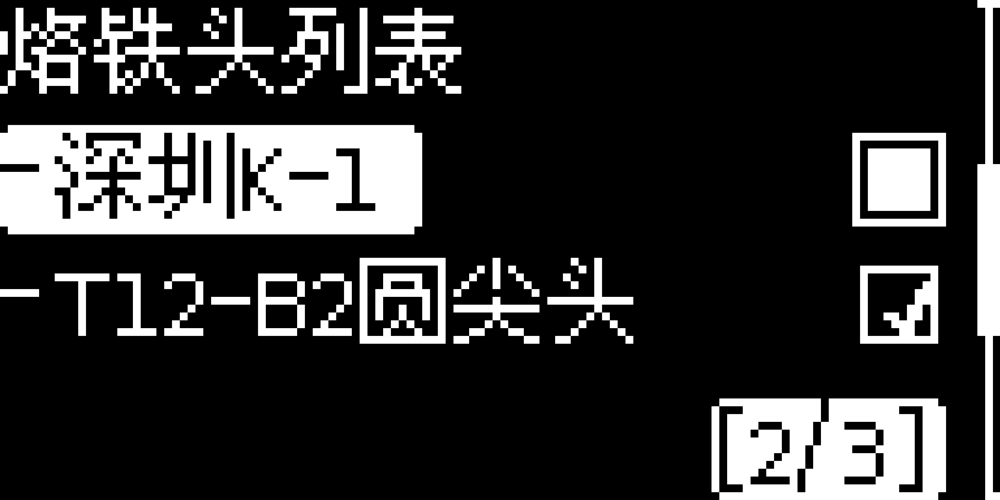

👇Temperature coefficient calibration

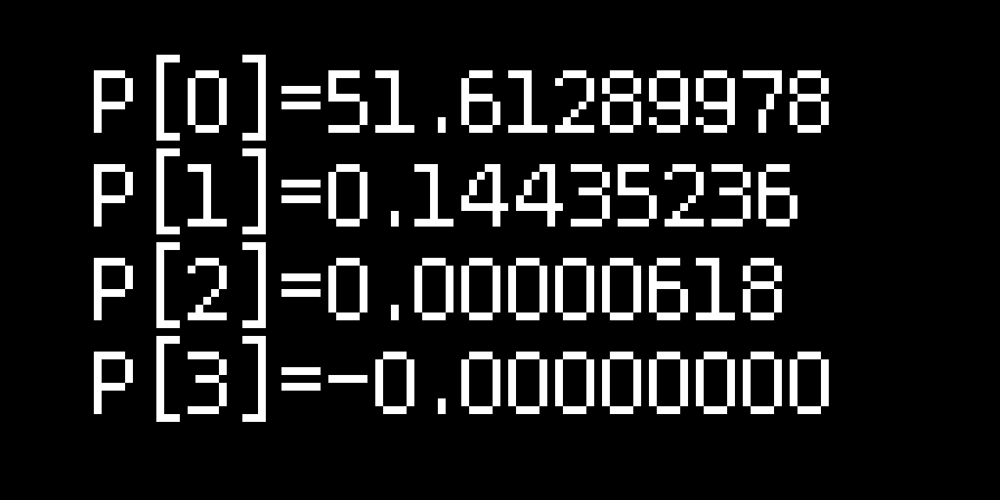
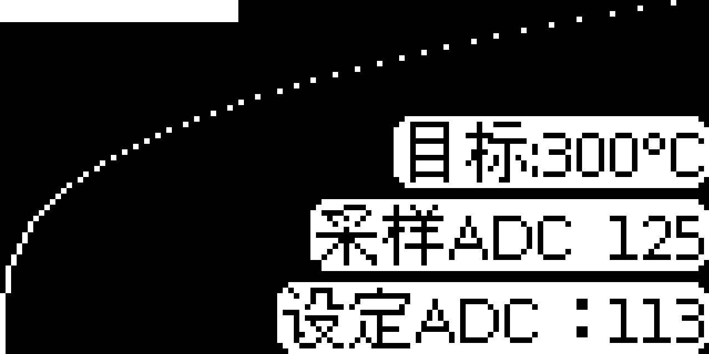

👇Text editor

👇Each soldering tip can be set with two sets of PID

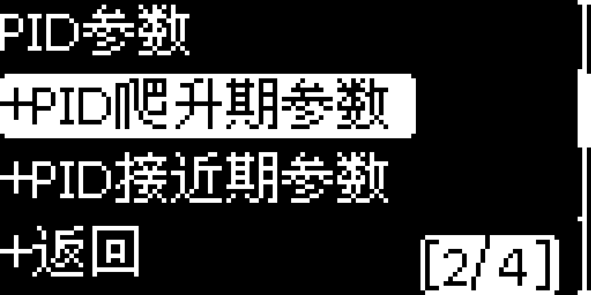
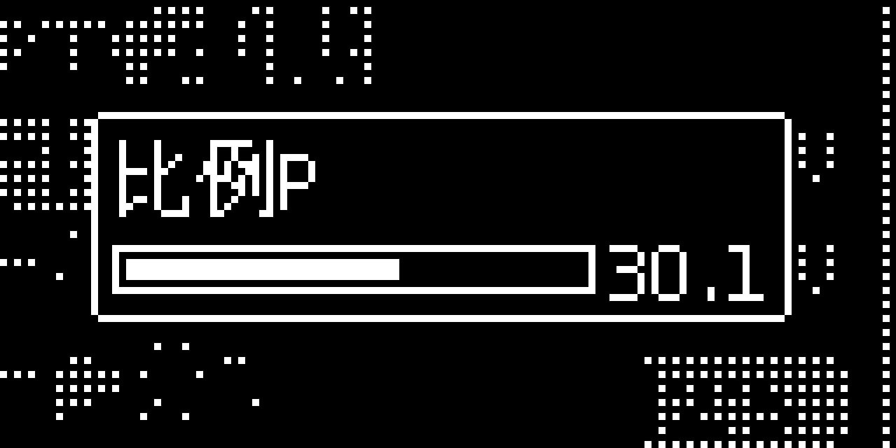

👇Personalization

