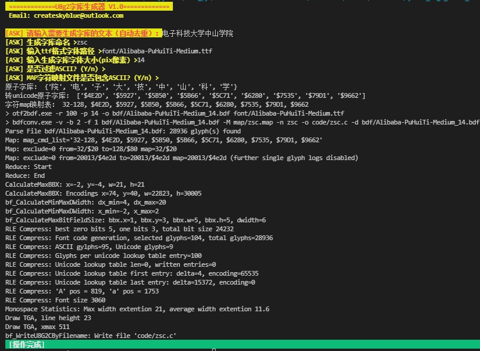
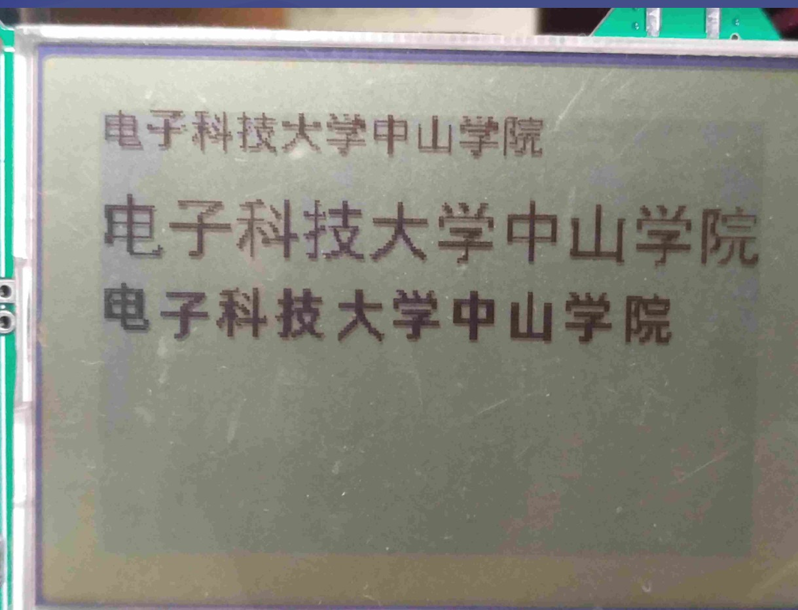

# Easy U8g2 font generate tools

这是一个易于操作的U8g2字体生成工具，使用者只需要输入需要转换的文本，选择字体文件以及设置字体大小，该工具会自动对文本进行去重、生成map字体映射文件、生成bdf字库并最终导出C语言字库代码

## 开源协议

main.py适用于GPL3.0协议

## 实现功能

- [X] 自定义文本
- [X] 文本自动去重
- [X] ASCII字符可选
- [X] 自定义ttf字体
- [X] 自定义字体大小
- [X] 字间距调整

## 使用方式

    python3 main.py

## 第三方工具使用

| 名称 | 来源 |
| :----: | :----:  |
| bdfconv | <https://github.com/olikraus/u8g2> |
| otf2bdf | <http://sofia.nmsu.edu/~mleisher/Software/otf2bdf/> |
| Alibaba-PuHuiTi-Medium | <https://ics.alibaba.com/project/Hn8mXx> |

## 演示图片

