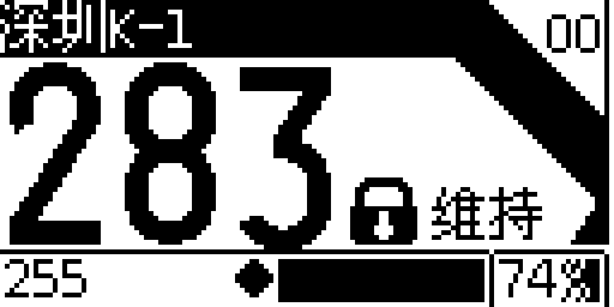

# 这是一个预览版

主控ESP32,正式版将兼容ESP8266

## 引脚定义
屏幕SCL         ->22
屏幕SDA         ->21
蜂鸣器          ->25
ADC             ->34
电压ADC         ->35
PWM输出(PMOS)   ->23
震动开关        ->18

## 关于电压ADC的接线方式
24V电源＋---47K电阻----(电压ADC引线)---4.7K电阻---24V电源地